## Xcode多環境與Bitrise自動部署設定

### 1. 建立Xcode環境設定檔

* 建立`Development xcconfig`
* 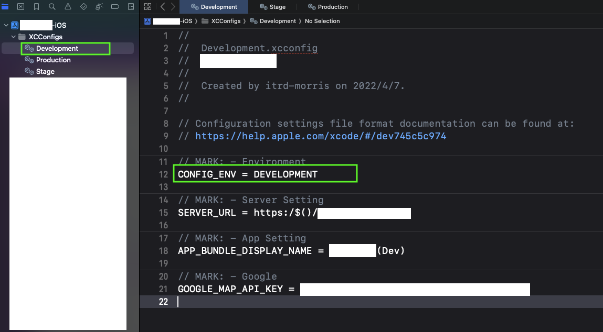
* 建立`Production xcconfig`
* 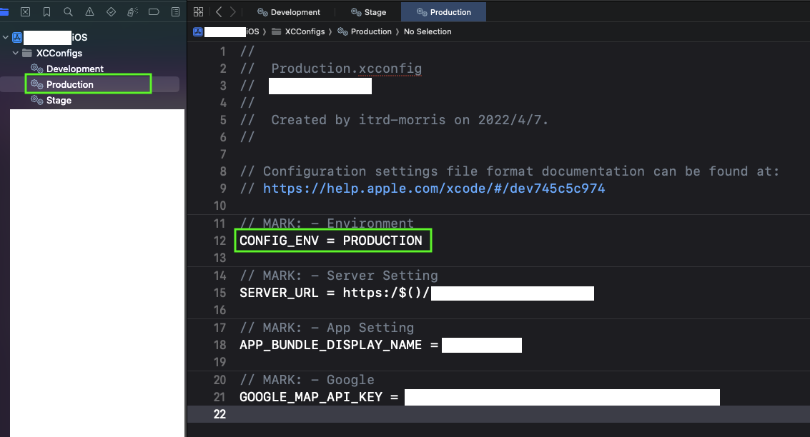

### 2. 設定Xcode Project Configurations

* 建立`Debug Configuration`，並選擇環境設定檔為`Development xcconfig`
* 建立`Stage Configuration`，並選擇環境設定檔為`Stage xcconfig`
* 建立`Release Configuration`，並選擇環境設定檔為`Production xcconfig`
* 

### 3. 建立Xcode Build Schemes

* 建立`Development Scheme`
* 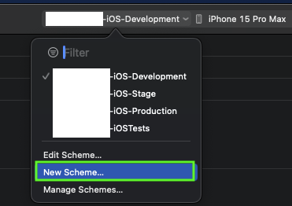
* 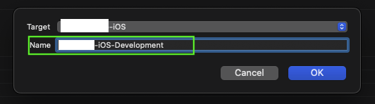
* 設定`Development Scheme`
* 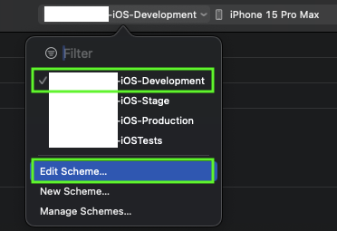
* 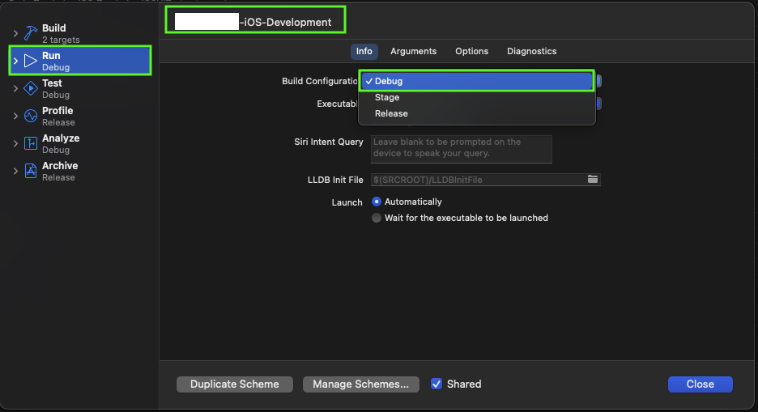

### 4. 設定Xcode Signing
* 設定Signing為`Automatically Manage Signing`
* 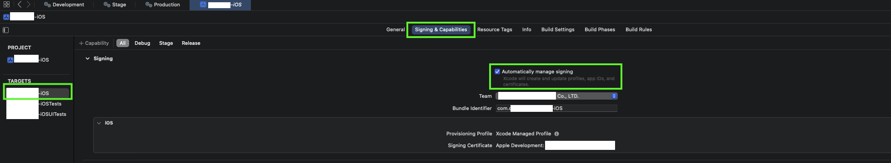

### 5. 設定Bitrise綁定Apple Service Connection

* 設定方式如[網站](https://github.com/morrischen/Gitlab-Bitrise-CICD/tree/main?tab=readme-ov-file#11-%E8%A8%AD%E5%AE%9Abitrise%E7%B6%81%E5%AE%9Aapple-service-connection)
* App Store Connect API金鑰的存取權限，必須為`管理者`權限
* 設定Bitrise `API Key`與`App Store Connect`
* 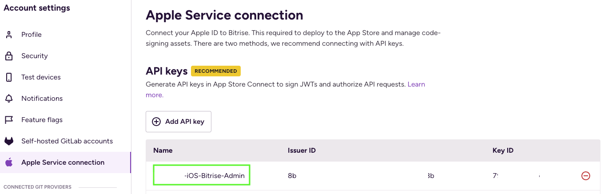
* 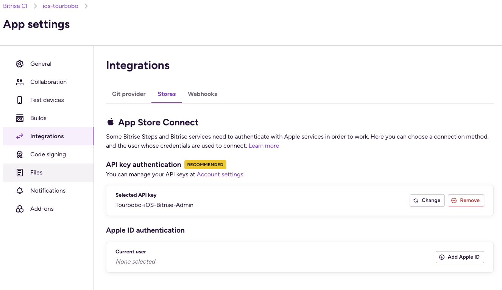

### 6. 設定Bitrise Code Signing

* 匯出Certificate如[網站](https://github.com/morrischen/Gitlab-Bitrise-CICD/tree/main?tab=readme-ov-file#14-%E8%A8%AD%E5%AE%9Acodesign)
* 建議同時上傳`Development`與`Distribution`Certificate，這樣Bitrise就不會產生新的Certificate
* 因為使用Bitrise `Automatic code signing`，無須上傳Provisioning Profile檔案
* 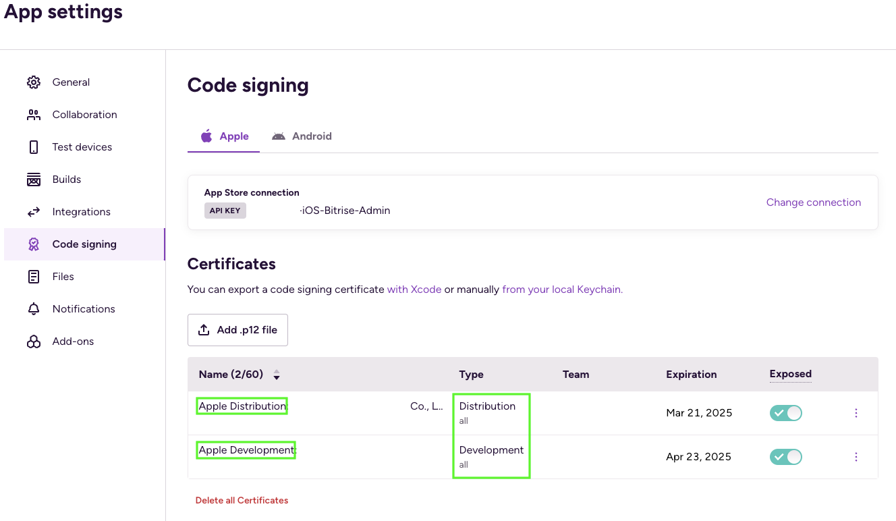

### 7. 設定Workflows

* 建立`deployDevelopment`Workflow，參考[網站](https://github.com/morrischen/Gitlab-Bitrise-CICD/tree/main?tab=readme-ov-file#13-%E8%A8%AD%E5%AE%9Aworkflows)
* 刪除`Certificate and profile installer`步驟
* 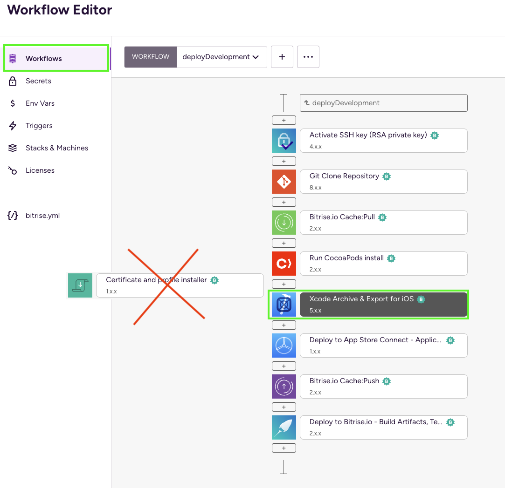
* 設定`Xcode Archive & Export for iOS`Configuration
  - `Scheme`: 設定為第三步驟建立的Scheme，例如: xxx-iOS-Development
  - `Distribution method`: 設定為app-store
* 設定`Xcodebuild Configuration`
  - `Build Configuration`: 設定為第二步驟建立的Configuration，例如: Debug
* 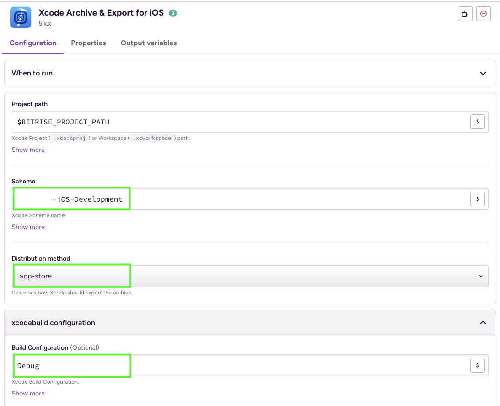
* 設定`Automatic Code Signing`
  - `Automatic code signing method`: 設定為api-key方式
* 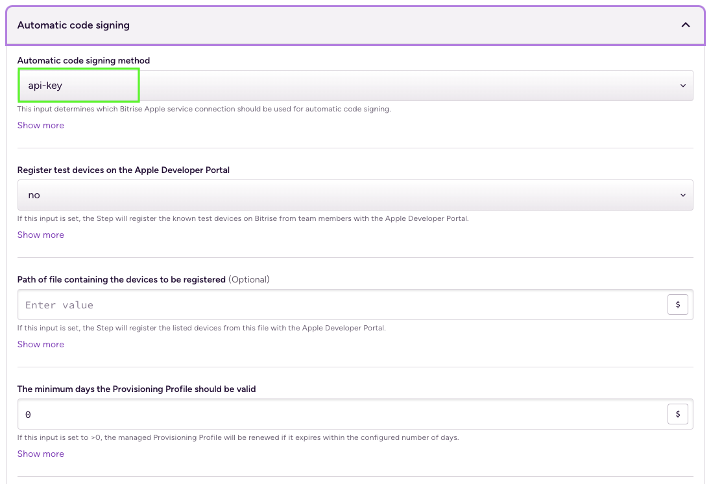
* `deployProduction` Workflow 設置大致相同
* 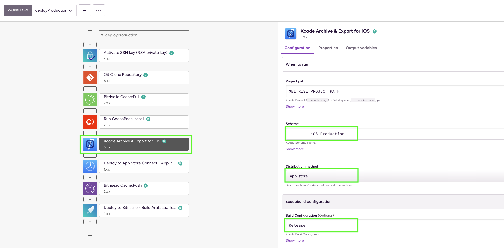

### 8. 設定Triggers

* Tag規則如下
  - `V-*`: 代表V-開頭的tag會觸發`deployProduction workflow`
  - `Stage-*`: 代表Stage-開頭的tag會觸發`deployStage workflow`
  - `Dev-*`: 代表Dev-開頭的tag會觸發`deployDevelopment workflow`
* 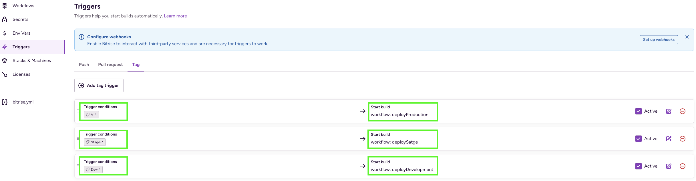

### 9. 測試不同環境部署

* 測試部署到`Development`、`Stage`和`Production`這三個環境，並將應用程式上傳到 App Store Connect。
* 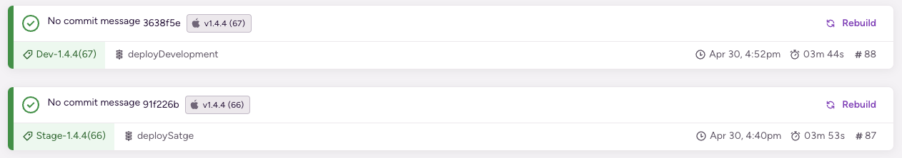
* 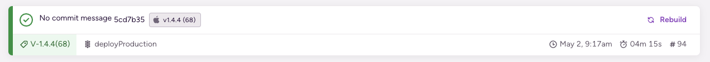
* 在`Xcode Archive & Export for iOS`步驟的日誌中顯示，Bitrise 透過 API 金鑰的方式下載憑證檔案。
* 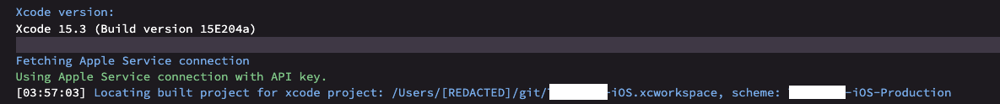
* 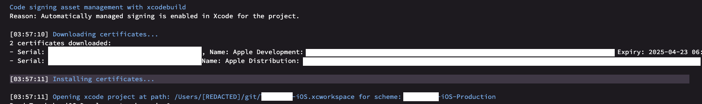
