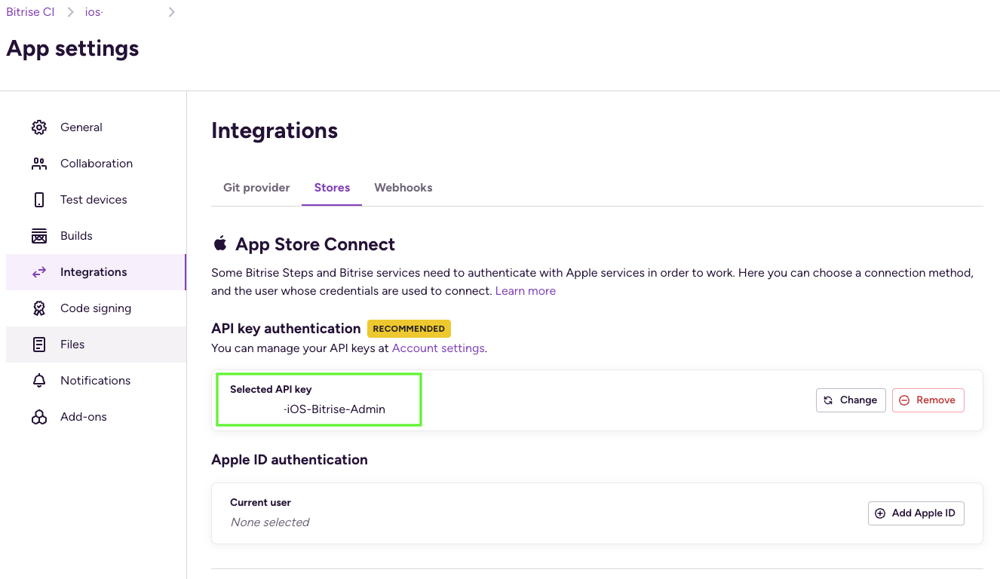

## Xcode多環境與Bitrise自動部署設定

### 1. 建立Xcode環境設定檔

* 建立`Development xcconfig`
* 
* 建立`Production xcconfig`
* 

### 2. 設定Xcode Project的Configurations

* 建立`Debug Configuration`，並選擇環境設定檔為`Development xcconfig`
* 建立`Stage Configuration`，並選擇環境設定檔為`Stage xcconfig`
* 建立`Release Configuration`，並選擇環境設定檔為`Production xcconfig`
* 

### 3. 建立Xcode Build Schemes

* 建立`Development Scheme`
* 
* 
* 設定`Development Scheme`
* 
* 

### 4. 設定Xcode Signing
* 設定Signing為`Automatically Manage Signing`
* 

### 5. 設定Bitrise綁定Apple Service Connection

* 設定方式如[網站](https://github.com/morrischen/Gitlab-Bitrise-CICD/tree/main?tab=readme-ov-file#11-%E8%A8%AD%E5%AE%9Abitrise%E7%B6%81%E5%AE%9Aapple-service-connection)
* App Store Connect API金鑰的存取權限需設定為`管理者`權限
* Bitrise設定`API Key`與`App Store Connect`
* 
* 

### 6. 設定Bitrise Code Signing

* 匯出Certificate如[網站](https://github.com/morrischen/Gitlab-Bitrise-CICD/tree/main?tab=readme-ov-file#14-%E8%A8%AD%E5%AE%9Acodesign)
* 上傳`Development`與`Distribution`Certificate，建議上傳這兩個Certificate，Bitrise才不會產生新的Certificate
* 因為使用Bitrise `Automatic code signing`，無須上傳Provisioning Profile檔案
* 

### 7. 設定Workflows

* 建立`deployDevelopment`Workflow，參考[網站]([https://github.com/morrischen/Gitlab-Bitrise-CICD/tree/main?tab=readme-ov-file#14-%E8%A8%AD%E5%AE%9Acodesign](https://github.com/morrischen/Gitlab-Bitrise-CICD/tree/main?tab=readme-ov-file#13-%E8%A8%AD%E5%AE%9Aworkflows))
* 刪除`Certificate and profile installer`步驟
* 
* 設定Xcode Archive & Export for iOS中的參數
* `Scheme`: 設定為第三步驟建立的Scheme，例如: xxx-iOS-Development
* `Distribution method`: 設定為app-store
* 設定Xcodebuild Configuration
* `Build Configuration`: 設定為第二步驟建立的Configuration，例如: Debug
* 
* 設定Automatic Code Signing
* `Automatic code signing method`: 設定為api-key方式
* 
