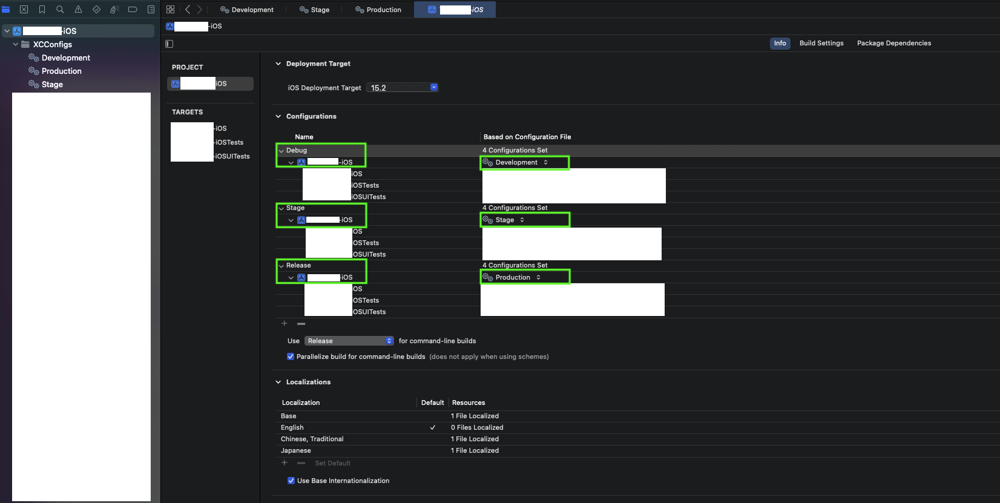

## Xcode多環境與Bitrise自動部署設定

### 1. 建立Xcode環境設定檔

* 建立`Development xcconfig`
* 
* 建立`Production xcconfig`
* 

### 2. 設定Xcode Project的Configurations

* 建立`Debug Configuration`，並選擇環境設定檔為`Development xcconfig`
* 建立`Stage Configuration`，並選擇環境設定檔為`Stage xcconfig`
* 建立`Release Configuration`，並選擇環境設定檔為`Production xcconfig`
* 

### 3. 建立Xcode Build Schemes

* 建立`Development Scheme`
* 
* 
* 設定`Development Scheme`
* 
* 

### 4. 設定Xcode Signing
* 設定Signing為`Automatically Manage Signing`
* 

### 5. 設定Bitrise綁定Apple Service Connection

* 設定方式如[網站](https://github.com/morrischen/Gitlab-Bitrise-CICD/tree/main?tab=readme-ov-file#11-%E8%A8%AD%E5%AE%9Abitrise%E7%B6%81%E5%AE%9Aapple-service-connection)
* App Store Connect API金鑰的存取權限需設定為`管理者`權限
* Bitrise設定`API Key`與`App Store Connect`
* 
* 
